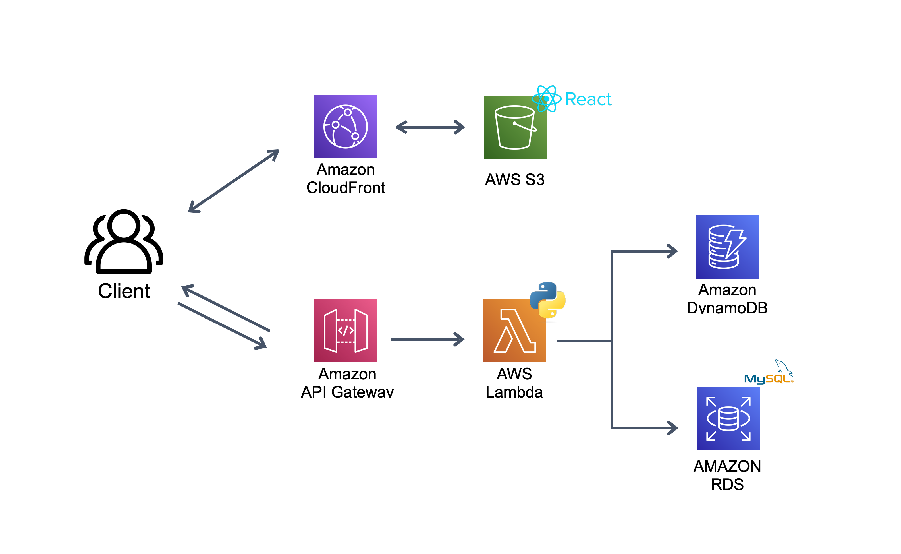
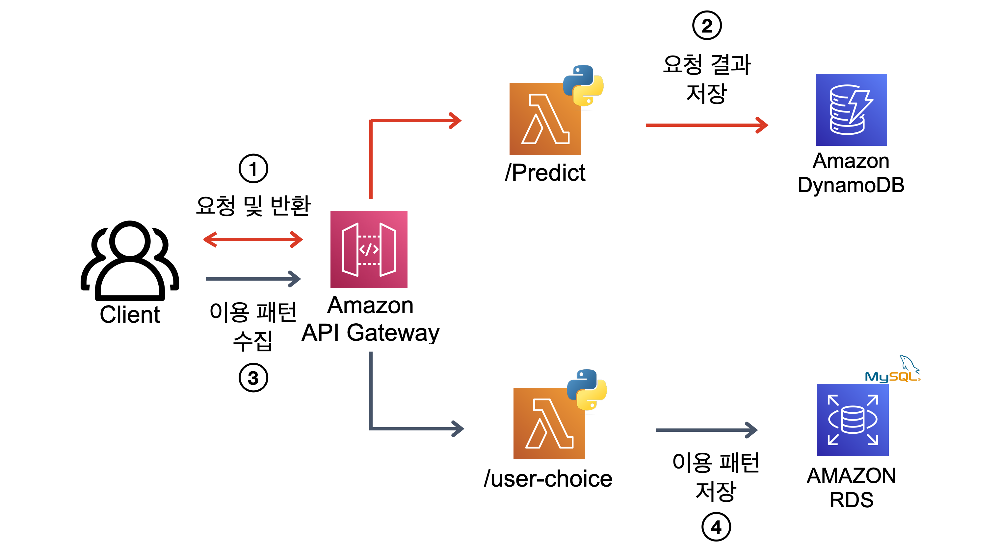

# 서버리스 웹 서비스 구축

<br/>
```
프로젝트 형태 : 1인 개발
프로젝트 기간 : 2023.02.16 - 2023.05.22(3개월)
Github 주소 : sss
사용 기술 : Lambda, Dynamo DB, RDS, Word2Vec, SentenceBert, React
```
<br/>

### 프로젝트 소개

- 도서관 내 비치된 컴퓨터 & 과학 분야 도서를 키워드를 기반으로 찾아주는 서비스 구현

- Docker-compose로 구축했던 [도서관 장서 검색 서비스]를 AWS Cloud 기반 서버리스로 재구축

- 리포팅 자동화를 위한 데이터 파이프라인 구축 프로젝트와 연계 목적으로 서버리스 재구축 기획

- [서비스 페이지](https://yangoos.me)에 접속하여 이용 가능

https://user-images.githubusercontent.com/98074313/226160516-234422e5-ebfb-4daa-9105-52ee225d6f83.mov

<br/>

### 프로젝트 아키텍처



<br/>

### 서버리스 백엔드 구현 - Lambda, Dynamo DB, RDS 활용

Lambda, Dynamo DB, RDS를 활용해 서버리스 백엔드를 구축했으며, API로 사용자 요청을 처리하는 `/predict`와 사용자 행동 데이터를 저장하는 `/user-choice` 개발



#### Lambda 선정 이유

- 리포팅 자동화를 위한 데이터 파이프라인 구축 프로젝트에 필요한 데이터 생성을 위해 대량의 API 요청 처리가 가능한 백엔드 구축 필요

- 머신러닝 기반으로 도서 검색을 지원하는 서비스이므로 초기 백엔드 구현 시 EC2와 ECS를 검토

- ECS와 EC2로 백엔드를 구축할 경우 제한된 EC2 성능(t2-micro)으로 인해 대량 요청 처리 시 수십 개의 Instance 실행이 필요해 오버헤드가 증가하는 문제 발생

- lambda의 경우 250mb 용량 제한이 있지만 lambda-container로 해결 가능하고, 머신러닝 서비스를 서버리스로 구축 가능하다는 점에서 서비스 확장에 활용도가 높다고 판단

- 또한 Lambda 활용 시 추가로 운영해야할 서비스가 없는 가장 단순한 구조라 판단하여 도입 결정

#### Dynamo DB 선정 이유

- 백엔드에서 처리한 Json 타입의 사용자 요청 결과를 별도의 데이터 처리없이 저장 가능한 DataBase 구축 필요

- 요청 결과 반환 시 백엔드 내부에서 데이터를 가공하여 RDS에 저장하는 방법을 고민했으나 대량으로 가공하는 방법이 효율적이라 판단

- 사용자 요청 결과를 Dynamo DB에 저장한 뒤 AWS Glue 또는 pyspark를 활용해 일 단위 배치로 Redshift에 저장하는 방식 도입

<br/>

### 프론트엔드 구현 - Cloudfront, S3 활용

#### S3 선정 이유

- 별도 서버 구축없이 S3 업로드만으로 웹호스팅이 가능하며, Lambda와 연계 가능한 효율적인 구조라 판단
- AWS S3 Sync와 React Build, Git 명령어 조합으로 간편하게 CI/CD를 도입해 효율적인 개발 환경 구축 가능

#### CloudFront 선정 이유

- 클라이언트가 S3에 바로 접근할 경우 1,000건의 request 당 `$0.0045` 비용이 부과되는 반면 Cloudfront의 웹캐시 기능을 사용하여 서비스 시 Cloudfront의 1000만건 무료 request와 1000건 당 `$0.0009`로 제공이 가능해 S3만 사용하는 구조 대비 저렴한 비용으로 운영 가능

- S3로 웹 호스팅의 경우 HTTPS 사용이 불가능하고 bucket을 public으로 공개해야하지만, Cloudfront를 활용할 경우 S3 비공개로 웹호스팅이 가능하고 HTTPS를 사용이 가능하므로 보안 상 이점이 있다고 판단
