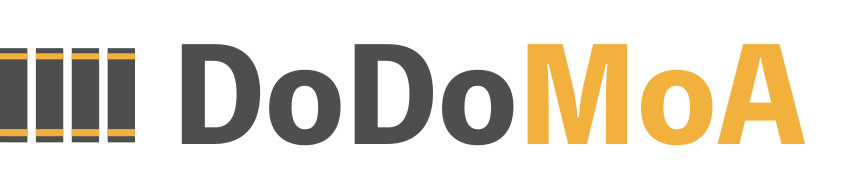
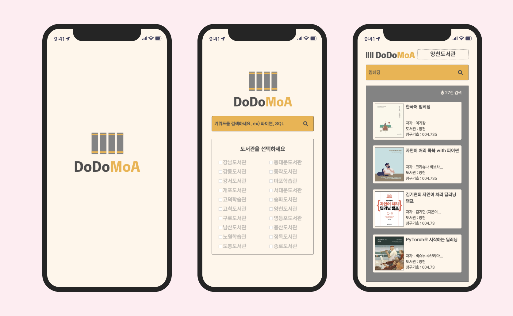
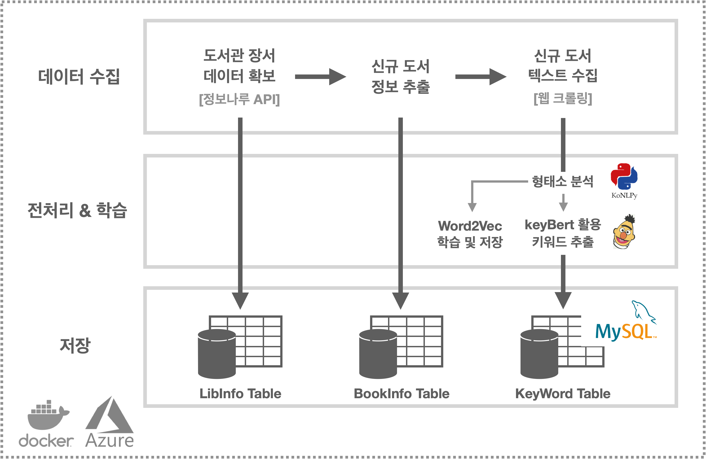
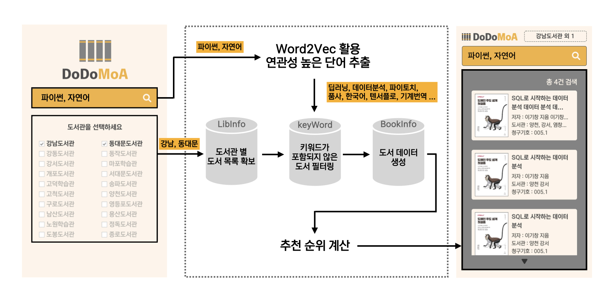

<div align='center'>
    
</div>

<br/>

<div align='center' size='20px'> <h3> 도도모아는 서울교육청 산하 20개 도서관이 보유한 컴퓨터, 데이터 분야 도서를 추천하는 앱입니다.</h3>

##

<div align='center'>

**[프로젝트 진행 배경](#introduction)**
**&nbsp;|&nbsp; [검색 성능](#performance)**
**&nbsp;|&nbsp; [앱 사용하기](#apps)**
**&nbsp;|&nbsp; [문제정의 및 해결](#consideration)**
**&nbsp;|&nbsp; [코드](#code)**
**&nbsp;|&nbsp; [머신러닝 파이프라인 소개](#pipeline)**
**&nbsp;|&nbsp; [도서 검색 단계 소개](#recommandationy)**

</div>
</div>

<br/>

## 프로젝트 진행 배경 <a name="introduction"></a>

평소 컴퓨터, 데이터 분야의 책을 빌릴때면 원하는 도서를 찾는데 어려움이 있었습니다. 도서 검색으로는 찾고자 하는 분야를 찾는데 한계가 있었으며 도서 분류 기준이 명확하지 않아 같은 분야임에도 여러 책장에 분산되어 직접 찾는 방법에도 어려움이 있었습니다. 이러한 불편함을 해결하기 위해 NLP 기반 도서 검색 프로젝트를 기획했습니다.

<div>
    
</div>

<br/>

## 앱 사용하기 <a name="performance"></a>

아이콘을 클릭하시면 도도모아 페이지로 이동합니다.
<br/>

<a href="http://yangoos.me/dodo"></a>

<br/>

## Demo <a name="performance"></a>

<div>
    
</div>

```

도서관 검색 시 .... 1건

# 검색어 : 임베딩   |   도서관 : 양천
--------------------------------------
1. 한국어 임베딩


도도모아 검색 시 .... 31건

# 검색어 : 임베딩   |   도서관 : 양천
--------------------------------------
1. 한국어 임베딩
2. 자연어 처리 쿡북 with 파이썬
3. 김기현의 자연어 처리 딥러닝 캠프
4. PyTorch로 시작하는 딥러닝
5. 파이썬으로 배우는 자연어 처리 인 액션
6. 그로킹 딥러닝 : 알기 쉬운 비유와 기초 수학으로 시작하는
7. 텐서플로와 머신러닝으로 시작하는 자연어 처리
...

```

<br/>

## 문제 정의 및 해결 <a name="consideration"></a>

## 코드 <a name="code"></a>

링크를 클릭하시면 코드를 확인하실 수 있습니다.

- <a href="https://github.com/yangoos57/dodomoa/blob/main/dodoPipeline.py">**머신러닝 파이프라인**</a>
- <a href="https://github.com/yangoos57/dodomoa/blob/main/dodoutils.py" >**백엔드**</a>
- <a href="https://github.com/yangoos57/seoulBikeProject/tree/main/frontend/src/components/dodomoa">**프론트엔드**</a>

<br/>

## 머신러닝 파이프라인 소개 <a name="pipeline"></a>

<div align='center'>
    
</div>

<br/>

### 도서관 장서 데이터 확보 및 도서정보 크롤링

- 정보나루 API 활용 도서관 장서 데이터 업데이트
- 기존 장서 데이터과 업데이트 된 장서 데이터를 비교해 신규 도서 목록 확보
- 웹 크롤링을 통해 도서소개, 목차, 추천사 등 키워드 추출에 필요한 텍스트 수집

### word2vec 학습 및 keyBert 활용 키워드 추출

- Konlpy 활용 형태소 분석, 영문단어 한글 치환, Stopwords 제거 등 전처리 수행
- 전처리 데이터 활용 Word2Vec 학습 및 keyBert로 도서 키워드 추출

### 정제 데이터 DB에 저장

- 데이터 수집/전처리 및 학습 단계에서 확보한 데이터를 세 종류의 테이블에 저장

<br/><br/>

## 도서 검색 단계 소개 <a name="recommandation"></a>

<div>
    
</div>

<br/>

### Word2Vec 활용 연관 키워드 추출

- 사용자가 검색한 키워드를 Word2Vec의 Input 데이터로 활용해 연관성이 높은 키워드 20개 추출
- Ex) `파이썬`, `자연어` 검색 시 `딥러닝`, `데이터분석`, `파이토치`, `품사` 등 연관성 높은 키워드 추출
- 추출 키워드를 활용해 도서 검색 및 도서 추천순위 계산에 활용

### 키워드 기반 도서 목록 생성

- 사용자가 선택한 도서관의 장서 데이터 및 도서 키워드를 DB에서 추출
- 확보한 도서 목록과 word2vec에서 추출한 20개의 키워드 비교를 통한 도서 선별
- 추출 도서의 제목, 저자, 청구기호와 같은 정보를 종합해 도서 목록 생성

### 도서 추천순위 계산

- 일치하는 키워드가 많은 도서일수록 높은 순위로 추천
- 검색 단어와 Word2Vec에서 추출한 키워드의 중요도가 다르기 때문에 사용자 검색 키워드는 3점, 추출 키워드는 1점으로 계산
- Ex) `파이썬`, `자연어` 검색 시, `딥러닝`, `데이터분석`, `파이토치` , `품사` 등 연관 키워드 추출
- `파이썬`, `자연어`, `딥러닝` 키워드를 보유한 도서 A는 파이썬, 자연어가 사용자 검색 키워드이므로 각 3점, 딥러닝은 추출 키워드이므로 1점, 총 7점, `딥러닝`, `데이터분석`, `파이토치` 키워드를 보유한 도서 B는 모두 추출 키워드이므로 3점 부여
- 점수가 높은 A 도서가 B 도서보다 상위에 추천

<br/>
<br/>
<hr/>
<br/>
