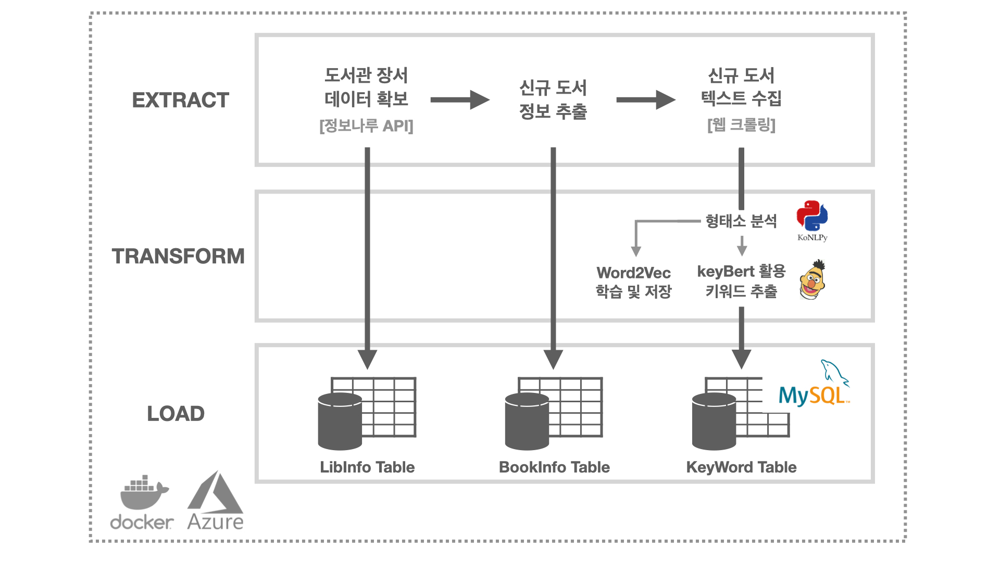

# 도도모아(DoDoMoA)

    

---

**[프로젝트 소개](#introduction)**
**&nbsp;|&nbsp; [주요 기능](#features)**
**&nbsp;|&nbsp; [추천 성능](#performance)**
**&nbsp;|&nbsp; [앱 사용하기](#apps)**
**&nbsp;|&nbsp; [활용 데이터](#dataset)**
**&nbsp;|&nbsp; [문제 정의 및 해결](#consideration)**
**&nbsp;|&nbsp; [코드보기](#code)**
**&nbsp;|&nbsp; [데이터 파이프라인 소개](#pipeline)**
**&nbsp;|&nbsp; [도서 추천 알고리즘 소개](#recommandationy)**

  

## 프로젝트 소개 

---

**도도모아는 서울 교육청 산하 21개 도서관이 보유한 컴퓨터 과학분야의 도서를 추천하는 앱입니다.**

평소 도서관에서 데이터와 개발에 관한 책을 빌릴때 원하는 도서를 찾는데 어려움이 있었습니다.
도서관의 도서 분류 기준이 명확하지 않아 같은 분야의 책이 여러 책장에 분산되어 있어서 직접 찾기에는 많은 시간을 필요로 했고,
도서 검색으로는 원하는 내용이 포함된 책을 찾는데 한계가 있었습니다. 원하는 분야의 책을 빠르고 정확하게 찾기 위해 이 프로젝트를 기획했습니다.

<사진 넣기>

  

## 주요기능 

---

- 키워드 검색 시 관련성 높은 도서 추천
- 도서 제목으로 검색 시 연관성이 높은 도서 추천
- 영문 키워드로 검색 가능 ex) python, react

## 성능 

---

  

## 앱 사용하기 

---

  

## 문제 정의 및 해결 

---

### 도서 추천 방법

**문제**

도서를 간편하게 찾기 위한 추천 방법에 대해 고민했습니다.

**접근법**

하나의 도서를 여러 개의 키워드로 정의한 다음, 사용자가 검색한 단어와 일치하는 키워드가 많은 순대로 도서를 추천하는 방법을 고민했습니다. 예로들어, 사용자가 `파이썬`, `데이터`, `matplotlib`을 검색하면 일치하는 키워드가 많은 도서 순으로 추천됩니다.

도서 별 키워드 추출을 위해서 TF-IDF, Word2Vec, keyBert를 고려했습니다. TF-IDF의 경우 준수한 성능을 보였으나, 다른 문장과 구분하는 키워드를 추출하는 데 목적이 있다보니 학습 텍스트 내에 포함된 사람 이름을 키워드로 추출하는 문제가 있었습니다.

Word2Vec의 경우 문장별 추출 보다는 단어간 연관성을 찾는데 특화된 툴이므로 개별 도서의 키워드를 추출하기 위해서는 적절하지 않았습니다.

keyBert의 경우 개별 문서에서 키워드를 추출하는데 특화된 툴이고, 기존에 학습된 모델을 불러와 사용하여 실용적이었으며, 파인튜닝 없이도 준수한 키워드 추출 성능을 보였습니다. 따라서 효율성과 성능을 모두 겸비한 keyBert를 추출 모델로 활용했습니다.

 

### 추천 알고리즘 문제점 개선

**문제**

사용자가 검색한 키워드의 갯수에 따라 추천 성능에 차이가 있었습니다. 특히 사용자가 하나의 키워드로만 검색할 경우, 키워드가 포함 된 수많은 도서 중 어떤 도서를 우선적으로 추천해야하는지에 대한 어려움이 있었습니다.

**접근법**

사용자가 검색하는 키워드 개수가 많을수록 더 정확한 추천 성능을 보여줍니다. 하지만 사용자에게 다양한 키워드를 요구하는 것은 앱을 사용하는데 피로를 유발할 수 있습니다.

word2vec를 활용해 이 문제를 해결했습니다. 사용자가 검색한 키워드와 연관성이 높은 키워드 20개를 추출해 도서 검색에 활용했습니다. `파이썬`을 검색하는 경우, 코사인 유사도가 높은 20개 키워드(`인터프리터`, `아나콘다`, `주피터`, `맷플롯립`, `넘파이` , `판다스` ….)를 추출해 도서 검색에 활용합니다.

사용자가 검색한 키워드와 word2vec에서 추출된 키워드에는 중요도의 차이가 있습니다. 따라서 사용자가 검색한 단어별로 3배의 가중치가 부여되어 계산 됩니다. `파이썬`을 검색한 경우 `파이썬`, `주피터`, `판다스`가 포함된 도서는 점수는 `파이썬` 3점, `주피터` 1점, `판다스` 1점, 총 5점이 됩니다. 반면 `주피터`, `맷플롯립`, `넘파이`가 포함된 도서는 키워드가 전부 word2vec에서 추출된 것인이므로 3점이 됩니다.

이러한 방식을 통해 사용자에게 다양한 키워드를 요구하지 않아도 도서를 선별해 추천할 수 있도록 프로그램을 개선했습니다.

  

## 코드 보기 

---

해당 페이지별로 파일 별 간단한 설명을 포함한 markdown을 작성했습니다.

- 데이터 파이프라인 :
- 도서 추천 모델 :
- 프론트엔드 :
- 백엔드 :

  

## 데이터 파이프라인 소개 

---

    

 

### **도서관 장서 데이터 확보 및 도서정보 크롤링(Extract)**

- 정보나루 API 활용 도서관 별 장서 데이터 업데이트
- 기존 장서 데이터과 업데이트 장서 데이터를 비교해 DB에 없는 도서 목록 확보
- 웹 크롤링을 통해 도서소개, 목차, 추천사 등 키워드 추출에 필요한 텍스트 수집

### **word2vec 학습 및 keyBert로 키워드 추출(Transfrom)**

- Konlpy를 활용해 확보한 텍스트에 대한 형태소 분석 수행
- 형태소 자료 활용 Word2Vec 학습 및 keyBert로 개별 도서 키워드를 추출

### 확보한 데이터 **DB에 저장(Load)**

- 개별 단계에서 확보한 데이터는 세 종류의 데이터 테이블에 저장
- LibInfo Table은 개별 도서관의 보유 도서 목록 저장
- BookInfo Table은 도서 정보 저장
- Keyword Table은 형태소 분석 결과와 도서 키워드 저장

  

## 도서 추천 알고리즘 소개 

---

    

 

### Word2Vec 활용 연관 키워드 추출

- 사용자가 검색한 키워드를 Word2Vec의 Input 검색어로 활용해 연관성이 높은 키워드 20개를 추출
  Ex) 사용자가 `파이썬` ,`자연어`를 검색 시 `딥러닝`, `데이터분석`, `파이토치`, `품사`등 연관성이 높은 단어를 추출
- 추출 된 키워드는 검색 및 도서 추천 순위 계산에 활용

### 도서 목록 생성

- 사용자가 선택한 도서관의 도서 데이터 및 개별 도서의 키워드 확보
- 확보된 도서 목록과 word2vec에서 추출한 20개의 키워드를 비교, 키워드가 하나 이상 포함된 도서 추출
- 추출 도서의 도서 제목, 저자, 청구기호를 도서 DB에서 검색하여 도서 목록 생성

### 도서 추천 순위 계산

- 일치하는 키워드가 많을수록 사용자에게 높은 우선순위로 추천
- 사용자가 직접 검색한 키워드와 추출한 키워드의 중요도가 다르기 때문에 word2vec 추출 키워드는 1점, 사용자 검색 키워드는 3점으로 계산
  ex) 사용자가 `파이썬`, `자연어` 검색 시, `딥러닝`, `데이터분석`, `파이토치` , `품사` 등 연관키워드가 추출
  `파이썬`, `자연어`, `딥러닝`키워드를 가지고 있는 도서 A는 7점, `딥러닝`, `데이터분석`, `파이토치` 키워드를 가지고 있는 도서 B는 총 3점이 부여
- 점수가 더 높은 A 도서가 B 도서 보다 상위에 추천

  
