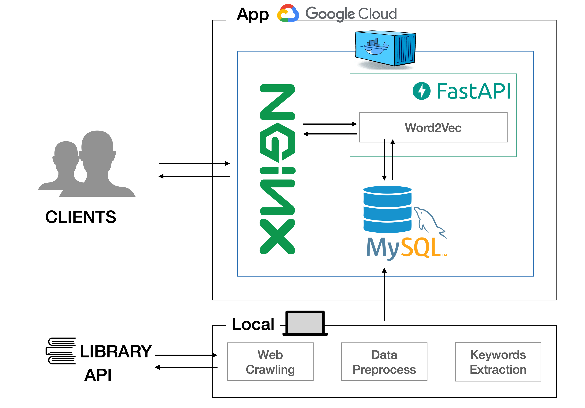

## 도서관 장서 추천

### 개요

개인 프로젝트로 진행한 [Sbert를 활용한 도서 키워드 추출 모델](https://github.com/yangoos57/Sentence_bert_from_scratch/blob/main/keyword_extraction_using_sbert/main.ipynb)을 활용해 도서관 장서 검색 서비스를 구현하였습니다.

### 프로젝트 진행 배경

평소 컴퓨터, 데이터 분야의 책을 빌릴때면 원하는 도서를 찾는데 어려움이 있었습니다. 도서 검색으로는 찾고자 하는 분야를 찾는데 한계가 있었으며 도서 분류 기준이 명확하지 않아 같은 분야임에도 여러 책장에 분산되어 직접 찾는 방법에도 어려움이 있었습니다. 이러한 불편함을 해결하기 위해 NLP 기반 도서 검색 프로젝트를 기획했습니다.

### 프로젝트 구현 결과
> [링크](http://yangoos.me/)를 클릭하시면 서비스를 이동 하실 수 있습니다.

https://user-images.githubusercontent.com/98074313/226160516-234422e5-ebfb-4daa-9105-52ee225d6f83.mov

### 프로젝트 구조

 

 

### 프로젝트 구현 사항

#### 데이터 수집 자동화 및 학습 파이프라인 구축

- 매월 도서 정보가 업데이트 되는 시점에 맞춰 데이터 수집 및 모델 학습을 자동화하는 파이프라인을 로컬 환경에 구축

- [Sbert 기반 키워드 추출 모델](https://github.com/yangoos57/Sentence_bert_from_scratch/blob/main/keyword_extraction_using_sbert/main.ipynb)을 활용해 도서를 대표하는 핵심 키워드를 추출하고 DB에 저장

#### 웹 서버 개발

- Word2Vec 활용한 키워드 기반 도서 검색 서비스 구현

- 도서 이미지, 웹페이지 처리를 담당하는 NGINX 구축하여 검색 서버 부하 최소화

- PC, 모바일에서 사용가능하도록 반응형 웹 구현
